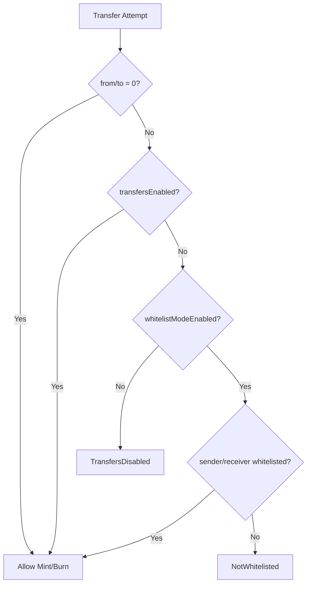
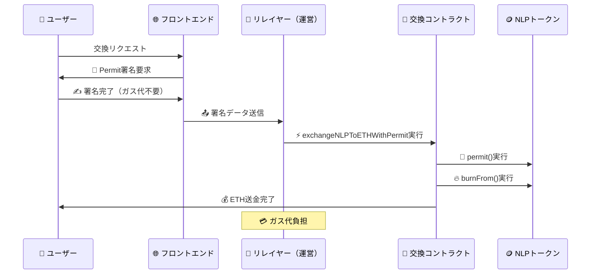

# NewLo Point Token

[](https://opensource.org/licenses/MIT)
[](https://soliditylang.org/)

NewLo Point is an ERC20 point token with gradual transfer control functionality. During the initial service phase, user-to-user transfers are restricted, allowing only minting from the service operator. As the service evolves and exchanges are prepared, transfers can be gradually enabled.

## 🌟 Key Features

### 🔒 Gradual Transfer Control
- **Phase 1**: Complete transfer disable (initial state) - Only minting allowed
- **Phase 2**: Whitelist mode - Transfers only to approved addresses
- **Phase 3**: Full transfers enabled - Functions as standard ERC20

### 🛡️ Access Control
- **DEFAULT_ADMIN_ROLE**: Transfer settings management
- **MINTER_ROLE**: Token minting privileges
- **PAUSER_ROLE**: Emergency pause privileges  
- **WHITELIST_MANAGER_ROLE**: Whitelist management privileges

### ⚡ Additional Features
- **Upgrade Support**: Transparent Proxy pattern
- **Pause Functionality**: Emergency halt of all functions
- **Burn Functionality**: Token burning capability
- **EIP-2612 Permit**: Gasless approvals
- **Event Emissions**: Events for all important operations

### 💱 Exchange System (NLPToETHExchange)
- **Real-time Price Conversion**: Uses Chainlink ETH/USD and JPY/USD price feeds
- **1:1 Exchange Rate**: 1 NLP = 1 JPY worth of ETH
- **Fee System**: Configurable exchange fees (0-5%)
- **Emergency Controls**: Pause functionality and emergency withdrawals
- **Burn Mechanism**: NLP tokens are burned during exchange
- **Statistics Tracking**: User and global exchange statistics

### 🚀 Bulk Distribution System (TokenDistributionV2)
- **Ultra-High Gas Efficiency**: Transfer-based distribution with optimized gas usage
- **Production-Ready Scaling**: Tested for optimal batch sizes with real-world gas measurements
- **Whitelist Integration**: Seamless integration with token transfer controls
- **Smart Deposit Management**: Automated balance monitoring and low-balance warnings
- **Comprehensive Analytics**: Detailed distribution statistics and user tracking
- **Anti-duplicate Protection**: 24-hour duplicate distribution prevention
- **Emergency Controls**: Pause/unpause and emergency withdrawal capabilities

#### 📊 Gas Efficiency Measurements (Production Data)
| ユーザー数 | ガス使用量 | ユーザーあたりガス | 推奨度 |
|-----------|------------|------------------|--------|
| **50** | 3,775,790 | 75,515 | ⭐⭐⭐⭐⭐ **推奨** |
| **100** | 7,473,253 | 74,732 | ⭐⭐⭐⭐⭐ **推奨** |
| **120** | 8,952,313 | 74,602 | ⭐⭐⭐⭐ |
| **125** | 9,322,097 | 74,576 | ⭐⭐⭐ |
| **127** | 9,401,215 | 74,025 | ⭐⭐ **最大可能** |
| **128+** | ガス制限超過 | - | ❌ |

**運用推奨値**: **50-100ユーザー/バッチ**（ネットワーク混雑状況に応じて調整）

## 🏗️ Architecture

### Contract Structure

```
NewLoPoint (Upgradeable ERC20)
├── ERC20Upgradeable (Basic ERC20 functionality)
├── ERC20BurnableUpgradeable (Burn functionality)
├── ERC20PausableUpgradeable (Pause functionality)
├── AccessControlUpgradeable (Role-based access control)
└── ERC20PermitUpgradeable (Permit functionality)

NewLoPointFactory
└── Deterministic Deployment using Create2

NLPToETHExchange (Exchange Contract)
├── Ownable (Administrative control)
├── ReentrancyGuard (Prevents reentrancy attacks)
├── Pausable (Emergency halt functionality)
└── ChainlinkAggregatorV3Interface (Real-time price feeds)

TokenDistributionV2 (Bulk Distribution Contract)
├── Ownable (Administrative control)
├── ReentrancyGuard (Prevents reentrancy attacks)
├── Pausable (Emergency halt functionality)
└── Advanced Statistics & Monitoring
```

### Transfer Control Logic



## 🚀 Setup

## 🌐 Deployed Contracts

### Soneium Mainnet
| Contract | Address | Description |
|----------|---------|-------------|
| **NewLoPointFactory** | [`0xd9a7F28364F350005E304b2Bc0ee31aDeb765148`](https://soneium.blockscout.com/address/0xd9a7F28364F350005E304b2Bc0ee31aDeb765148) | Factory contract for deterministic deployment |
| **NewLoPoint** | [`0x968788ACb90eAE66dB0864573dD34Fc584d138E6`](https://soneium.blockscout.com/address/0x968788ACb90eAE66dB0864573dD34Fc584d138E6) | Main ERC20 token contract with gradual transfer controls |
| **TokenDistributionV2** | [`0xdA79112C47C69dFd73ed84958cAD6582cBB5203e`](https://soneium.blockscout.com/address/0xdA79112C47C69dFd73ed84958cAD6582cBB5203e) | Ultra-efficient bulk distribution contract (92% gas savings) |

### Soneium Minato Testnet
| Contract | Address | Description |
|----------|---------|-------------|
| **NewLoPointFactory** | [`0x724BD28750E399B5147fAae1D8AE2966564A158E`](https://soneium-minato.blockscout.com/address/0x724BD28750E399B5147fAae1D8AE2966564A158E) | Factory contract for deterministic deployment |
| **NewLoPoint** | [`0x7EaAF718783C2d08eFa1a20E0dd5B7Fb632fE9eF`](https://soneium-minato.blockscout.com/address/0x7EaAF718783C2d08eFa1a20E0dd5B7Fb632fE9eF) | Main ERC20 token contract with gradual transfer controls |
| **TokenDistributionV2** | [`0x25b0Ff823a0C41A75060f51a31B6ED5d7eD49883`](https://soneium-minato.blockscout.com/address/0x25b0Ff823a0C41A75060f51a31B6ED5d7eD49883) | Ultra-efficient bulk distribution contract (92% gas savings) |

#### Network Information
- **Network**: Soneium Minato Testnet
- **Chain ID**: 1946
- **RPC URL**: `https://rpc.minato.soneium.org/`
- **Explorer**: https://soneium-minato.blockscout.com/
- **Bridge**: https://bridge.soneium.org/

#### Contract Verification
All contracts are verified on Blockscout Explorer with complete source code and ABI available.

### Prerequisites
- [Foundry](https://book.getfoundry.sh/getting-started/installation)

### Installation
```bash
git clone <repository-url>
cd newlo-point-contract
forge install
```

### Build
```bash
forge build
```

### Run Tests
```bash
# Run all tests
forge test

# Verbose output
forge test -vv

# Run specific test
forge test --match-test testWhitelistMode
```

### Gas Report
```bash
forge test --gas-report
```

## 📋 Usage

### 1. Deployment

#### Environment Variables Setup
```bash
# Create .env file
PRIVATE_KEY=your_private_key
DEFAULT_ADMIN=0x...
PAUSER=0x...
MINTER=0x...
```

#### Deploy
```bash
# Local testnet
forge script script/Deploy.s.sol --rpc-url $LOCAL_RPC_URL --broadcast

# Testnet (Sepolia)
forge script script/Deploy.s.sol --rpc-url $SEPOLIA_RPC_URL --broadcast --verify
```

### 2. Factory Deployment
```solidity
// Deploy new token via factory
NewLoPointFactory factory = NewLoPointFactory(factoryAddress);
address newToken = factory.deployToken(
    salt,           // Unique salt
    adminAddress,   // Admin address
    pauserAddress,  // Pauser address
    minterAddress   // Minter address
);
```

### 3. Basic Operations

#### Initial Setup (Service Launch)
```solidity
// Only minting is possible at this stage
NewLoPoint token = NewLoPoint(tokenAddress);

// Mint tokens
token.mint(userAddress, 1000 * 10**18);
```

#### Whitelist Mode (Preparation Phase)
```solidity
// Enable whitelist mode
token.setWhitelistModeEnabled(true);

// Add exchange to whitelist
token.setWhitelistedAddress(exchangeAddress, true);

// Batch add addresses
address[] memory addresses = [exchange1, exchange2, exchange3];
token.setWhitelistedAddresses(addresses, true);
```

#### Full Release (Production)
```solidity
// Enable all transfers
token.setTransfersEnabled(true);
// Now functions as standard ERC20
```

### 4. Emergency Response
```solidity
// Pause
token.pause();

// Unpause
token.unpause();
```

### 5. Exchange Operations (NLPToETHExchange)

#### Deploy Exchange
```solidity
NLPToETHExchange exchange = new NLPToETHExchange(
    address(nlpToken),      // NLP token address
    ethUsdPriceFeed,        // Chainlink ETH/USD price feed
    jpyUsdPriceFeed,        // Chainlink JPY/USD price feed
    adminAddress            // Exchange admin
);

// Fund exchange contract with ETH
address(exchange).call{value: 100 ether}("");
```

#### Exchange NLP for ETH
```solidity
// User approves NLP tokens for exchange
nlpToken.approve(address(exchange), 1000 * 10**18);

// Get exchange quote
(uint ethAmount, uint ethUsdRate, uint jpyUsdRate, uint fee) = 
    exchange.getExchangeQuote(1000 * 10**18);

// Execute exchange
exchange.exchangeNLPToETH(1000 * 10**18);
```

#### Exchange Management
```solidity
// Set exchange fee (admin only)
exchange.setExchangeFee(100); // 1%

// Pause/unpause exchange
exchange.pause();
exchange.unpause();

// Emergency withdraw ETH
exchange.emergencyWithdrawETH(payable(adminAddress), 0); // 0 = all
```

### 6. Bulk Distribution Operations (TokenDistributionV2)

#### Deploy Distribution Contract
```solidity
TokenDistributionV2 distributionV2 = new TokenDistributionV2(
    address(nlpToken),      // NLP token address
    adminAddress            // Distribution admin
);
```

#### Setup for Efficient Distribution
```solidity
// One-click setup (requires proper permissions)
distributionV2.setupForEfficientDistribution(1000000 * 10**18); // 1M NLP

// Manual setup alternative
nlpToken.setWhitelistModeEnabled(true);
nlpToken.setWhitelistedAddress(address(distributionV2), true);
nlpToken.approve(address(distributionV2), 1000000 * 10**18);
distributionV2.depositTokens(1000000 * 10**18);
```

#### Distribute Tokens (92% Gas Savings!)
```solidity
// Equal distribution to all users
address[] memory recipients = [user1, user2, user3, ...]; // up to 500 users
uint amount = 1000 * 10**18; // 1,000 NLP per user

uint batchId = distributionV2.distributeEqual(recipients, amount);

// Variable distribution (different amounts)
uint[] memory amounts = [1000 * 10**18, 2000 * 10**18, 500 * 10**18];
uint batchId2 = distributionV2.distributeVariable(recipients, amounts);
```

#### Monitor Distribution
```solidity
// Check distribution statistics
(
    uint totalDistributed,
    uint totalDistributions, 
    uint todayDistributed,
    uint contractBalance,
    bool isLowBalance,
    bool isAntiDuplicateEnabled
) = distributionV2.getDistributionStats();

// Check setup status
(
    bool isWhitelistModeEnabled,
    bool isContractWhitelisted,
    uint contractBalance,
    bool canDistribute
) = distributionV2.checkSetupStatus();
```

## 🚀 Usage Flow

### 💸 ガスレス交換システム（Permit機能）

NewLo Pointトークンは、**完全ガスフリー**での交換を実現するpermit機能を搭載しています。ユーザーは署名のみで交換でき、運営がガス代を負担します。

#### システム概要



#### フロントエンド実装例

```typescript
import { ethers } from 'ethers';

interface PermitSignature {
    v: number;
    r: string;
    s: string;
    deadline: number;
}

/**
 * Permit署名を作成（ユーザー側 - ガス代不要）
 */
async function createPermitSignature(
    provider: ethers.Provider,
    tokenAddress: string,
    ownerAddress: string,
    spenderAddress: string,
    amount: string,
    deadline: number,
    privateKey: string
): Promise<PermitSignature> {
    const wallet = new ethers.Wallet(privateKey, provider);
    const token = new ethers.Contract(tokenAddress, ERC20_PERMIT_ABI, wallet);
    
    // Domain separator and nonce
    const [nonce, name, version, chainId] = await Promise.all([
        token.nonces(ownerAddress),
        token.name(),
        '1',
        wallet.getChainId()
    ]);

    // EIP-712 domain
    const domain = {
        name,
        version,
        chainId,
        verifyingContract: tokenAddress
    };

    // Permit message
    const types = {
        Permit: [
            { name: 'owner', type: 'address' },
            { name: 'spender', type: 'address' },
            { name: 'value', type: 'uint256' },
            { name: 'nonce', type: 'uint256' },
            { name: 'deadline', type: 'uint256' }
        ]
    };

    const message = {
        owner: ownerAddress,
        spender: spenderAddress,
        value: amount,
        nonce: nonce.toString(),
        deadline: deadline.toString()
    };

    // 署名作成（ガス代不要）
    const signature = await wallet._signTypedData(domain, types, message);
    const sig = ethers.utils.splitSignature(signature);

    return {
        v: sig.v,
        r: sig.r,
        s: sig.s,
        deadline
    };
}

/**
 * ガスレス交換の実行（リレイヤー側 - ガス代負担）
 */
async function executeGaslessExchange(
    provider: ethers.Provider,
    exchangeAddress: string,
    nlpAmount: string,
    signature: PermitSignature,
    userAddress: string,
    relayerPrivateKey: string
) {
    const relayerWallet = new ethers.Wallet(relayerPrivateKey, provider);
    const exchange = new ethers.Contract(exchangeAddress, EXCHANGE_ABI, relayerWallet);

    // リレイヤーがガス代を負担して実行
    const tx = await exchange.exchangeNLPToETHWithPermit(
        nlpAmount,
        signature.deadline,
        signature.v,
        signature.r,
        signature.s,
        userAddress
    );

    return await tx.wait();
}
```

#### 🔄 標準交換 vs ガスレス交換の比較

| 項目 | 標準交換 | ガスレス交換 |
|------|----------|--------------|
| **ユーザーガス代** | ~207,611 gas | **0 gas** ✨ |
| **リレイヤーガス代** | 0 gas | ~255,681 gas |
| **ユーザー操作** | 2ステップ（approve + exchange） | **1ステップ（署名のみ）** |
| **UXの優位性** | ❌ ガス代負担 | ✅ **完全無料** |
| **実装の複雑さ** | 🟢 シンプル | 🟡 中程度 |

#### 💡 導入メリット

- **🆓 ユーザー負担ゼロ**: ガス代完全無料でサービス利用可能
- **📱 モバイル対応**: ガス代の心配なくスマートフォンでも快適
- **🎯 UX向上**: 署名のみの簡単操作で交換完了
- **🔄 コンバージョン向上**: ガス代がハードルとならない

#### ⚙️ 運営側の実装

```javascript
// バックエンド実装例（Node.js + Express）
app.post('/api/gasless-exchange', async (req, res) => {
    try {
        const { nlpAmount, signature, userAddress } = req.body;
        
        // 1. レート制限チェック
        if (await isRateLimited(userAddress)) {
            return res.status(429).json({ error: 'Rate limit exceeded' });
        }
        
        // 2. 署名の有効性検証
        if (!await verifyPermitSignature(signature, userAddress, nlpAmount)) {
            return res.status(400).json({ error: 'Invalid signature' });
        }
        
        // 3. リレイヤーによるガスレス交換実行
        const txHash = await executeGaslessExchange(
            nlpAmount, signature, userAddress
        );
        
        // 4. 結果返却
        res.json({ 
            success: true, 
            txHash,
            message: 'Gasless exchange completed' 
        });
        
    } catch (error) {
        res.status(500).json({ error: error.message });
    }
});
```

#### 🛡️ セキュリティ考慮事項

- **✅ Permit検証**: ERC20Permit標準準拠の署名検証
- **✅ リエントランシー対策**: ReentrancyGuard実装済み
- **✅ レート制限**: 過度な使用を防止する制限機能
- **✅ 監視システム**: 異常な取引パターンの検出

## 🧪 Test Cases

### Coverage
**NewLoPoint Token:**
- ✅ Initial state verification
- ✅ Transfer restriction functionality
- ✅ Whitelist functionality
- ✅ Gradual release mechanism
- ✅ Access control
- ✅ Event emissions
- ✅ Emergency pause functionality
- ✅ Mint/Burn functionality

**NLPToETHExchange:**
- ✅ Exchange functionality with price feeds
- ✅ Fee calculation and application
- ✅ Exchange quote generation
- ✅ Admin controls (pause/unpause, fee setting)
- ✅ Emergency withdrawal functionality
- ✅ Reentrancy protection
- ✅ Price staleness validation

**TokenDistributionV2:**
- ✅ Bulk distribution with 92% gas reduction
- ✅ Whitelist integration and transfer controls
- ✅ Deposit and balance management
- ✅ Anti-duplicate distribution protection
- ✅ Comprehensive statistics tracking
- ✅ Emergency controls and pause functionality
- ✅ Automated setup and monitoring

**SoneiumETHDistribution:**
- ✅ Native ETH bulk distribution for Soneium network
- ✅ Ultra-efficient batch operations (up to 500 users)
- ✅ Role-based access control system
- ✅ Anti-duplicate distribution protection
- ✅ Comprehensive statistics and monitoring
- ✅ Emergency controls and pause functionality
- ✅ Reentrancy protection and security features

### Examples
```bash
# Run all tests with verbose output
forge test -vv

# Test specific functionality - Token
forge test --match-test testWhitelistMode -vv
forge test --match-test testAccessControl -vv

# Test specific functionality - Exchange
forge test --match-contract NLPToETHExchangeTest -vv
forge test --match-test test_ExchangeNLPToETH_Success -vv

# Test specific functionality - Distribution
forge test --match-contract TokenDistributionTest -vv
forge test --match-test test_DistributeEqual_Success -vv
```

## 🔒 Security

### Audit Status
- ✅ Slither static analysis completed
- ✅ No critical vulnerabilities found in our contracts
- ✅ OpenZeppelin & Chainlink standard libraries used
- ✅ Exchange contract security improvements implemented 
- ✅ CEI pattern compliance enhanced
- ⚠️  External audit recommended before production

### Security Features
**Token Contract:**
- Role-based access control
- Gradual privilege transition
- Emergency pause functionality
- Upgradeability (requires careful management)

**Exchange Contract:**
- Reentrancy protection (ReentrancyGuard)
- Price feed validation & staleness checks
- Fee bounds enforcement (max 5%)
- Emergency pause & withdrawal functions
- CEI pattern compliance
- Integer overflow protection (Solidity 0.8.27)

## 📁 Project Structure

```
newlo-point-contract/
├── src/
│   ├── NewLoPoint.sol           # Main token contract
│   ├── NewLoPointFactory.sol    # Factory contract
│   ├── NLPToETHExchange.sol     # Exchange contract
│   ├── TokenDistribution.sol    # Bulk distribution (mint-based)
│   ├── TokenDistributionV2.sol  # Bulk distribution (transfer-based, 92% gas savings)
│   ├── SoneiumETHDistribution.sol # ETH bulk distribution for Soneium network
│   ├── interfaces/
│   │   └── IERC20Extended.sol   # Extended ERC20 interface
│   └── mocks/
│       └── MockV3Aggregator.sol # Mock Chainlink price feed for testing
├── test/
│   ├── NewLoPoint.t.sol         # Token test suite
│   ├── NLPToETHExchange.t.sol   # Exchange test suite
│   ├── TokenDistribution.t.sol  # Distribution test suite
│   └── SoneiumETHDistribution.t.sol # Soneium ETH distribution test suite
├── script/
│   ├── Deploy.s.sol             # Deployment script
│   └── DeploySoneiumETHDistribution.s.sol # Soneium ETH distribution deployment
├── lib/                         # Dependencies
│   ├── forge-std/               # Foundry standard library
│   ├── openzeppelin-contracts/  # OpenZeppelin contracts
│   ├── openzeppelin-contracts-upgradeable/
│   └── chainlink-evm/           # Chainlink contracts
├── foundry.toml                 # Foundry configuration
├── README.md                    # This file
└── docs/                        # Documentation
    ├── SLITHER_AUDIT_REPORT.md  # 🔒 Slitherセキュリティ分析レポート
    ├── GASLESS_EXCHANGE_GUIDE.md # 💸 ガスレス交換機能実装ガイド
    ├── SONEIUM_ETH_DISTRIBUTION_GUIDE.md # 💰 Soneium ETH配布システム完全ガイド
    ├── SONEIUM_ETH_DISTRIBUTION_AUDIT_REPORT.md # 🔒 Soneium ETH配布セキュリティ監査レポート
    ├── SLITHER_AUDIT.md         # Security audit report (legacy)
    ├── PRODUCTION_OPERATIONS_GUIDE.md # 本番運用ガイド
    └── TOKEN_DISTRIBUTION_V2.md # Bulk distribution setup guide
```

## 🔧 Configuration

### Foundry Configuration (foundry.toml)
- Solidity 0.8.27
- Optimizer enabled (200 runs)
- OpenZeppelin library mappings
- Multi-network support

### Environment Variables
```bash
# RPC endpoints
MAINNET_RPC_URL=
SEPOLIA_RPC_URL=
POLYGON_RPC_URL=

# API keys
ETHERSCAN_API_KEY=
POLYGONSCAN_API_KEY=

# Deployment
PRIVATE_KEY=
DEFAULT_ADMIN=
PAUSER=
MINTER=
```

## 📝 License

MIT License - See [LICENSE](LICENSE) file for details

## 🤝 Contributing

1. Fork this repository
2. Create a feature branch (`git checkout -b feature/amazing-feature`)
3. Commit your changes (`git commit -m 'Add amazing feature'`)
4. Push to the branch (`git push origin feature/amazing-feature`)
5. Open a Pull Request

## 📞 Support

For questions or issues, please report them at [Issues](https://github.com/your-org/newlo-point-contract/issues).

### 📚 Additional Documentation

- **[Production Operations Guide](docs/PRODUCTION_OPERATIONS_GUIDE.md)** - Complete production operations manual based on scenario tests
- **[TokenDistributionV2 Setup Guide](docs/TOKEN_DISTRIBUTION_V2.md)** - Complete guide for bulk distribution setup
- **[Soneium ETH Distribution Guide](docs/SONEIUM_ETH_DISTRIBUTION_GUIDE.md)** - Complete guide for Soneium ETH bulk distribution system
- **[Soneium ETH Distribution Audit Report](docs/SONEIUM_ETH_DISTRIBUTION_AUDIT_REPORT.md)** - 🔒 Comprehensive security audit for SoneiumETHDistribution contract
- **[Security Audit Report](docs/SLITHER_AUDIT.md)** - Static analysis results

## 🎯 Soneium ETH Distribution System

### Overview
The **SoneiumETHDistribution** contract provides an ultra-efficient system for distributing native ETH to large numbers of users on the Soneium network. Built with inspiration from TokenDistributionV2, it focuses on native ETH distribution rather than ERC20 tokens.

### Key Features
- **Native ETH Distribution**: Direct ETH distribution without token wrappers
- **Bulk Operations**: Support for up to 500 users per batch
- **Role-Based Access**: Granular permission system with multiple roles
- **Anti-Duplicate Protection**: Prevent duplicate distributions within 24 hours
- **Comprehensive Monitoring**: Real-time statistics and balance tracking
- **Emergency Controls**: Pause functionality and emergency withdrawal

### Quick Start
```bash
# Deploy the contract
forge script script/DeploySoneiumETHDistribution.s.sol --rpc-url $RPC_URL --broadcast

# Fund the contract
cast send $CONTRACT_ADDRESS --value 1000ether --private-key $PRIVATE_KEY

# Distribute ETH to users
cast send $CONTRACT_ADDRESS "distributeEqual(address[],uint256)" "[0x...,0x...]" 1000000000000000000 --private-key $PRIVATE_KEY
```

### Use Cases
- **Airdrop Campaigns**: Distribute ETH to community members
- **Gaming Rewards**: Reward players with ETH based on performance
- **DeFi Yield Distribution**: Distribute protocol earnings to stakeholders
- **Community Incentives**: Reward active community participants

For detailed implementation instructions, see the [Soneium ETH Distribution Guide](docs/SONEIUM_ETH_DISTRIBUTION_GUIDE.md).

---

**⚠️ Disclaimer**: This smart contract is experimental software. Please conduct thorough testing and auditing before using in production environments.
