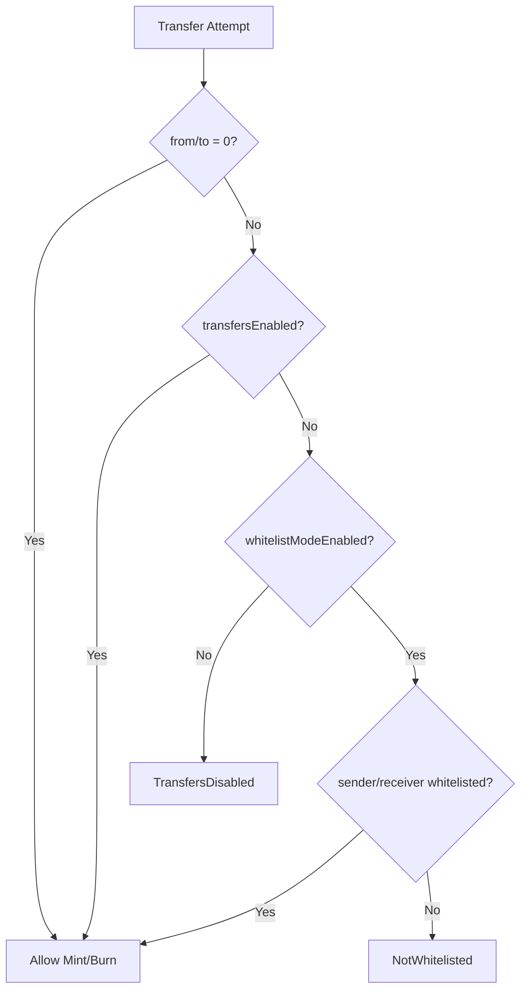

# NewLo Point Token

[](https://opensource.org/licenses/MIT)
[](https://soliditylang.org/)

NewLo Point is an ERC20 point token with gradual transfer control functionality. During the initial service phase, user-to-user transfers are restricted, allowing only minting from the service operator. As the service evolves and exchanges are prepared, transfers can be gradually enabled.

## 🌟 Key Features

### 🔒 Gradual Transfer Control
- **Phase 1**: Complete transfer disable (initial state) - Only minting allowed
- **Phase 2**: Whitelist mode - Transfers only to approved addresses
- **Phase 3**: Full transfers enabled - Functions as standard ERC20

### 🛡️ Access Control
- **DEFAULT_ADMIN_ROLE**: Transfer settings management
- **MINTER_ROLE**: Token minting privileges
- **PAUSER_ROLE**: Emergency pause privileges  
- **WHITELIST_MANAGER_ROLE**: Whitelist management privileges

### ⚡ Additional Features
- **Upgrade Support**: Transparent Proxy pattern
- **Pause Functionality**: Emergency halt of all functions
- **Burn Functionality**: Token burning capability
- **EIP-2612 Permit**: Gasless approvals
- **Event Emissions**: Events for all important operations

### 💱 Exchange System (NLPToETHExchange)
- **Real-time Price Conversion**: Uses Chainlink ETH/USD and JPY/USD price feeds
- **1:1 Exchange Rate**: 1 NLP = 1 JPY worth of ETH
- **Fee System**: Configurable exchange fees (0-5%)
- **Emergency Controls**: Pause functionality and emergency withdrawals
- **Burn Mechanism**: NLP tokens are burned during exchange
- **Statistics Tracking**: User and global exchange statistics

## 🏗️ Architecture

### Contract Structure

```
NewLoPoint (Upgradeable ERC20)
├── ERC20Upgradeable (Basic ERC20 functionality)
├── ERC20BurnableUpgradeable (Burn functionality)
├── ERC20PausableUpgradeable (Pause functionality)
├── AccessControlUpgradeable (Role-based access control)
└── ERC20PermitUpgradeable (Permit functionality)

NewLoPointFactory
└── Deterministic Deployment using Create2

NLPToETHExchange (Exchange Contract)
├── Ownable (Administrative control)
├── ReentrancyGuard (Prevents reentrancy attacks)
├── Pausable (Emergency halt functionality)
└── ChainlinkAggregatorV3Interface (Real-time price feeds)
```

### Transfer Control Logic



## 🚀 Setup

### Prerequisites
- [Foundry](https://book.getfoundry.sh/getting-started/installation)

### Installation
```bash
git clone <repository-url>
cd newlo-point-contract
forge install
```

### Build
```bash
forge build
```

### Run Tests
```bash
# Run all tests
forge test

# Verbose output
forge test -vv

# Run specific test
forge test --match-test testWhitelistMode
```

### Gas Report
```bash
forge test --gas-report
```

## 📋 Usage

### 1. Deployment

#### Environment Variables Setup
```bash
# Create .env file
PRIVATE_KEY=your_private_key
DEFAULT_ADMIN=0x...
PAUSER=0x...
MINTER=0x...
```

#### Deploy
```bash
# Local testnet
forge script script/Deploy.s.sol --rpc-url $LOCAL_RPC_URL --broadcast

# Testnet (Sepolia)
forge script script/Deploy.s.sol --rpc-url $SEPOLIA_RPC_URL --broadcast --verify
```

### 2. Factory Deployment
```solidity
// Deploy new token via factory
NewLoPointFactory factory = NewLoPointFactory(factoryAddress);
address newToken = factory.deployToken(
    salt,           // Unique salt
    adminAddress,   // Admin address
    pauserAddress,  // Pauser address
    minterAddress   // Minter address
);
```

### 3. Basic Operations

#### Initial Setup (Service Launch)
```solidity
// Only minting is possible at this stage
NewLoPoint token = NewLoPoint(tokenAddress);

// Mint tokens
token.mint(userAddress, 1000 * 10**18);
```

#### Whitelist Mode (Preparation Phase)
```solidity
// Enable whitelist mode
token.setWhitelistModeEnabled(true);

// Add exchange to whitelist
token.setWhitelistedAddress(exchangeAddress, true);

// Batch add addresses
address[] memory addresses = [exchange1, exchange2, exchange3];
token.setWhitelistedAddresses(addresses, true);
```

#### Full Release (Production)
```solidity
// Enable all transfers
token.setTransfersEnabled(true);
// Now functions as standard ERC20
```

### 4. Emergency Response
```solidity
// Pause
token.pause();

// Unpause
token.unpause();
```

### 5. Exchange Operations (NLPToETHExchange)

#### Deploy Exchange
```solidity
NLPToETHExchange exchange = new NLPToETHExchange(
    address(nlpToken),      // NLP token address
    ethUsdPriceFeed,        // Chainlink ETH/USD price feed
    jpyUsdPriceFeed,        // Chainlink JPY/USD price feed
    adminAddress            // Exchange admin
);

// Fund exchange contract with ETH
address(exchange).call{value: 100 ether}("");
```

#### Exchange NLP for ETH
```solidity
// User approves NLP tokens for exchange
nlpToken.approve(address(exchange), 1000 * 10**18);

// Get exchange quote
(uint ethAmount, uint ethUsdRate, uint jpyUsdRate, uint fee) = 
    exchange.getExchangeQuote(1000 * 10**18);

// Execute exchange
exchange.exchangeNLPToETH(1000 * 10**18);
```

#### Exchange Management
```solidity
// Set exchange fee (admin only)
exchange.setExchangeFee(100); // 1%

// Pause/unpause exchange
exchange.pause();
exchange.unpause();

// Emergency withdraw ETH
exchange.emergencyWithdrawETH(payable(adminAddress), 0); // 0 = all
```

## 🧪 Test Cases

### Coverage
**NewLoPoint Token:**
- ✅ Initial state verification
- ✅ Transfer restriction functionality
- ✅ Whitelist functionality
- ✅ Gradual release mechanism
- ✅ Access control
- ✅ Event emissions
- ✅ Emergency pause functionality
- ✅ Mint/Burn functionality

**NLPToETHExchange:**
- ✅ Exchange functionality with price feeds
- ✅ Fee calculation and application
- ✅ Exchange quote generation
- ✅ Admin controls (pause/unpause, fee setting)
- ✅ Emergency withdrawal functionality
- ✅ Reentrancy protection
- ✅ Price staleness validation

### Examples
```bash
# Run all tests with verbose output
forge test -vv

# Test specific functionality - Token
forge test --match-test testWhitelistMode -vv
forge test --match-test testAccessControl -vv

# Test specific functionality - Exchange
forge test --match-contract NLPToETHExchangeTest -vv
forge test --match-test test_ExchangeNLPToETH_Success -vv
```

## 🔒 Security

### Audit Status
- ✅ Slither static analysis completed
- ✅ No critical vulnerabilities found in our contracts
- ✅ OpenZeppelin & Chainlink standard libraries used
- ✅ Exchange contract security improvements implemented 
- ✅ CEI pattern compliance enhanced
- ⚠️  External audit recommended before production

### Security Features
**Token Contract:**
- Role-based access control
- Gradual privilege transition
- Emergency pause functionality
- Upgradeability (requires careful management)

**Exchange Contract:**
- Reentrancy protection (ReentrancyGuard)
- Price feed validation & staleness checks
- Fee bounds enforcement (max 5%)
- Emergency pause & withdrawal functions
- CEI pattern compliance
- Integer overflow protection (Solidity 0.8.27)

## 📁 Project Structure

```
newlo-point-contract/
├── src/
│   ├── NewLoPoint.sol           # Main token contract
│   ├── NewLoPointFactory.sol    # Factory contract
│   ├── NLPToETHExchange.sol     # Exchange contract
│   ├── interfaces/
│   │   └── IERC20Extended.sol   # Extended ERC20 interface
│   └── mocks/
│       └── MockV3Aggregator.sol # Mock Chainlink price feed for testing
├── test/
│   ├── NewLoPoint.t.sol         # Token test suite
│   └── NLPToETHExchange.t.sol   # Exchange test suite
├── script/
│   └── Deploy.s.sol             # Deployment script
├── lib/                         # Dependencies
│   ├── forge-std/               # Foundry standard library
│   ├── openzeppelin-contracts/  # OpenZeppelin contracts
│   ├── openzeppelin-contracts-upgradeable/
│   └── chainlink-evm/           # Chainlink contracts
├── foundry.toml                 # Foundry configuration
├── README.md                    # This file
└── docs/                        # Documentation
    └── SLITHER_AUDIT.md         # Security audit report
```

## 🔧 Configuration

### Foundry Configuration (foundry.toml)
- Solidity 0.8.27
- Optimizer enabled (200 runs)
- OpenZeppelin library mappings
- Multi-network support

### Environment Variables
```bash
# RPC endpoints
MAINNET_RPC_URL=
SEPOLIA_RPC_URL=
POLYGON_RPC_URL=

# API keys
ETHERSCAN_API_KEY=
POLYGONSCAN_API_KEY=

# Deployment
PRIVATE_KEY=
DEFAULT_ADMIN=
PAUSER=
MINTER=
```

## 📝 License

MIT License - See [LICENSE](LICENSE) file for details

## 🤝 Contributing

1. Fork this repository
2. Create a feature branch (`git checkout -b feature/amazing-feature`)
3. Commit your changes (`git commit -m 'Add amazing feature'`)
4. Push to the branch (`git push origin feature/amazing-feature`)
5. Open a Pull Request

## 📞 Support

For questions or issues, please report them at [Issues](https://github.com/your-org/newlo-point-contract/issues).

---

**⚠️ Disclaimer**: This smart contract is experimental software. Please conduct thorough testing and auditing before using in production environments.
