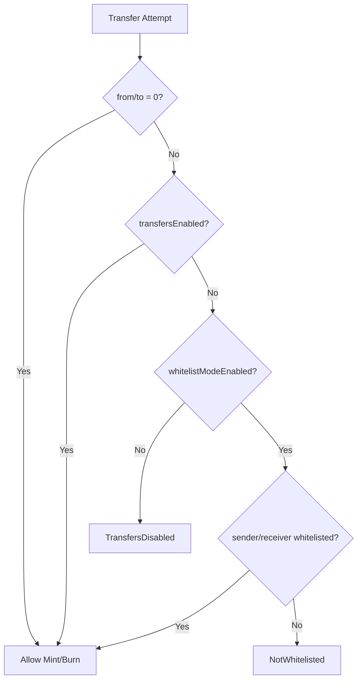

# Contract Address List

## 🌐 Deployed Contracts

### Soneium Mainnet
| Contract | Address | Description |
|----------|---------|-------------|
| **NewLoPointFactory** | [`0xd9a7F28364F350005E304b2Bc0ee31aDeb765148`](https://soneium.blockscout.com/address/0xd9a7F28364F350005E304b2Bc0ee31aDeb765148) | Factory contract for deterministic deployment |
| **NewLoPoint** | [`0x968788ACb90eAE66dB0864573dD34Fc584d138E6`](https://soneium.blockscout.com/address/0x968788ACb90eAE66dB0864573dD34Fc584d138E6) | Main ERC20 token contract with gradual transfer controls |
| **TokenDistributionV2** | [`0xdA79112C47C69dFd73ed84958cAD6582cBB5203e`](https://soneium.blockscout.com/address/0xdA79112C47C69dFd73ed84958cAD6582cBB5203e) | Ultra-efficient bulk distribution contract (92% gas savings) |
| **NLPToMultiTokenExchange** | [`0xe88C1a3881049C2eE65804F96CCd05DdAe02a17E`](https://soneium.blockscout.com/address/0xe88C1a3881049C2eE65804F96CCd05DdAe02a17E) | Exchange contract from NewLo Point (NLP) to multiple tokens (ETH, USDC, USDT) |

### Soneium Minato Testnet
| Contract | Address | Description |
|----------|---------|-------------|
| **NewLoPointFactory** | [`0x724BD28750E399B5147fAae1D8AE2966564A158E`](https://soneium-minato.blockscout.com/address/0x724BD28750E399B5147fAae1D8AE2966564A158E) | Factory contract for deterministic deployment |
| **NewLoPoint** | [`0x7EaAF718783C2d08eFa1a20E0dd5B7Fb632fE9eF`](https://soneium-minato.blockscout.com/address/0x7EaAF718783C2d08eFa1a20E0dd5B7Fb632fE9eF) | Main ERC20 token contract with gradual transfer controls |
| **TokenDistributionV2** | [`0xe2628c538f1da5f825f1a693A166b818f3881266`](https://soneium-minato.blockscout.com/address/0xe2628c538f1da5f825f1a693A166b818f3881266) | Ultra-efficient bulk distribution contract (92% gas savings) |
| **MultiTokenDistribtion** | [`0x09e22F5CE9F550115D1C560343c36F2C0d1C7BeC`](https://soneium-minato.blockscout.com/address/0x09e22F5CE9F550115D1C560343c36F2C0d1C7BeC) | Multiple token distribution contract for NewLo ecosystem |
| **NLPToMultiTokenExchange** | [`0x277bFeC2194B389Bb975035EB72D157f9eAa3887`](https://soneium-minato.blockscout.com/address/0x277bFeC2194B389Bb975035EB72D157f9eAa3887) | Exchange contract from NewLo Point (NLP) to multiple tokens (ETH, USDC, USDT) |
| **SoneiumETHDistribution** | [`0x8897494ac5B05486c76919055f68904344d78f5e`](https://soneium-minato.blockscout.com/address/0x8897494ac5B05486c76919055f68904344d78f5e) | Ultra-efficient bulk ETH distribution contract for Soneium network |

### Transfer Control Logic

