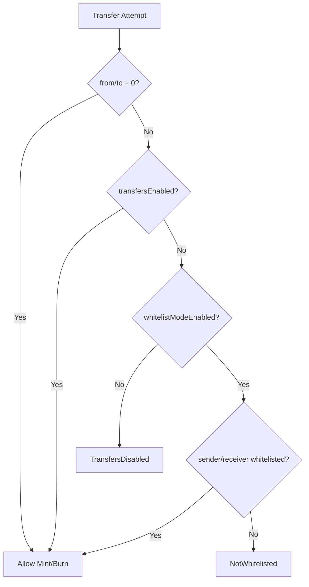

# Contract Address List

## 🌐 Deployed Contracts

### Soneium Mainnet
| Contract | Address | Description |
|----------|---------|-------------|
| **NewLoPointFactory** | [`0xd9a7F28364F350005E304b2Bc0ee31aDeb765148`](https://soneium.blockscout.com/address/0xd9a7F28364F350005E304b2Bc0ee31aDeb765148) | Factory contract for deterministic deployment |
| **NewLoPoint** | [`0x968788ACb90eAE66dB0864573dD34Fc584d138E6`](https://soneium.blockscout.com/address/0x968788ACb90eAE66dB0864573dD34Fc584d138E6) | Main ERC20 token contract with gradual transfer controls |
| **TokenDistributionV2** | [`0xdA79112C47C69dFd73ed84958cAD6582cBB5203e`](https://soneium.blockscout.com/address/0xdA79112C47C69dFd73ed84958cAD6582cBB5203e) | Ultra-efficient bulk distribution contract (92% gas savings) |
| **NLPToMultiTokenExchange** | [`0xe88C1a3881049C2eE65804F96CCd05DdAe02a17E`](https://soneium.blockscout.com/address/0xe88C1a3881049C2eE65804F96CCd05DdAe02a17E) | Exchange contract from NewLo Point (NLP) to multiple tokens (ETH, USDC, USDT) |

### Soneium Minato Testnet
| Contract | Address | Description |
|----------|---------|-------------|
| **NewLoPointFactory** | [`0x724BD28750E399B5147fAae1D8AE2966564A158E`](https://soneium-minato.blockscout.com/address/0x724BD28750E399B5147fAae1D8AE2966564A158E) | Factory contract for deterministic deployment |
| **NewLoPoint** | [`0x7EaAF718783C2d08eFa1a20E0dd5B7Fb632fE9eF`](https://soneium-minato.blockscout.com/address/0x7EaAF718783C2d08eFa1a20E0dd5B7Fb632fE9eF) | Main ERC20 token contract with gradual transfer controls |
| **TokenDistributionV2** | [`0xe2628c538f1da5f825f1a693A166b818f3881266`](https://soneium-minato.blockscout.com/address/0xe2628c538f1da5f825f1a693A166b818f3881266) | Ultra-efficient bulk distribution contract (92% gas savings) |
| **MultiTokenDistribtion** | [`0x09e22F5CE9F550115D1C560343c36F2C0d1C7BeC`](https://soneium-minato.blockscout.com/address/0x09e22F5CE9F550115D1C560343c36F2C0d1C7BeC) | Multiple token distribution contract for NewLo ecosystem |
| **NLPToMultiTokenExchange** | [`0x277bFeC2194B389Bb975035EB72D157f9eAa3887`](https://soneium-minato.blockscout.com/address/0x277bFeC2194B389Bb975035EB72D157f9eAa3887) | Exchange contract from NewLo Point (NLP) to multiple tokens (ETH, USDC, USDT) |
| **SoneiumETHDistribution** | [`0x8897494ac5B05486c76919055f68904344d78f5e`](https://soneium-minato.blockscout.com/address/0x8897494ac5B05486c76919055f68904344d78f5e) | Ultra-efficient bulk ETH distribution contract for Soneium network |
| **NLPToJPYCExchangeAdapter** | [`0xE00aB945a9430671Da7d25E5C9214B98220c63D7`](https://soneium-minato.blockscout.com/address/0xE00aB945a9430671Da7d25E5C9214B98220c63D7) | Cross-chain exchange adapter for NLP (Soneium) to JPYC (Polygon) conversion |

### KAIA Mainnet
| Contract | Address | Description |
|----------|---------|-------------|
| **NewLoPointFactory** | [`0xd9a7F28364F350005E304b2Bc0ee31aDeb765148`](https://kaiascan.io/address/0xd9a7F28364F350005E304b2Bc0ee31aDeb765148) | Factory contract for deterministic deployment |
| **NewLoPoint** | [`0x06f7c01C2b228bB0652Db978d2aB1062F1a36E1b`](https://kaiascan.io/address/0x06f7c01C2b228bB0652Db978d2aB1062F1a36E1b) | Main ERC20 token contract with gradual transfer controls |
| **TokenDistributionV2** | [`0x47B03Ca4742F64B2767c044aA4458c40E15EdF2B`](https://kaiascan.io/address/0x47B03Ca4742F64B2767c044aA4458c40E15EdF2B) | Ultra-efficient bulk distribution contract (92% gas savings) |
| **NLPToMultiTokenKaiaExchange** | [`0x75bA44a838f73A54b753D0eCEc246D939B58DA84`](https://kaiascan.io/address/0x75bA44a838f73A54b753D0eCEc246D939B58DA84) | Exchange contract from NewLo Point (NLP) to multiple tokens (KAIA, USDC, USDT) |

### Kairos(KAIA) Testnet
| Contract | Address | Description |
|----------|---------|-------------|
| **NewLoPointFactory** | [`0x8468D7401524A6f2997c4c99cdF6B50005778736`](https://kairos.kaiascan.io/address/0x8468D7401524A6f2997c4c99cdF6B50005778736) | Factory contract for deterministic deployment |
| **NewLoPoint** | [`0x73626144718baE2B3d0EBE230bC218ef9184086A`](https://kairos.kaiascan.io/address/0x73626144718baE2B3d0EBE230bC218ef9184086A) | Main ERC20 token contract with gradual transfer controls |
| **TokenDistributionV2** | [`0x47B03Ca4742F64B2767c044aA4458c40E15EdF2B`](https://kairos.kaiascan.io/address/0x47B03Ca4742F64B2767c044aA4458c40E15EdF2B) | Ultra-efficient bulk distribution contract (92% gas savings) |
| **NLPToMultiTokenKaiaExchange** | [`0x75bA44a838f73A54b753D0eCEc246D939B58DA84`](https://kairos.kaiascan.io/address/0x75bA44a838f73A54b753D0eCEc246D939B58DA84) | Exchange contract from NewLo Point (NLP) to multiple tokens (KAIA, USDC, USDT) |

### Transfer Control Logic

```mermaid
graph TD
    A[Transfer Attempt] --> B{from/to = 0?}
    B -->|Yes| C[Allow Mint/Burn]
    B -->|No| D{transfersEnabled?}
    D -->|Yes| C
    D -->|No| E{whitelistModeEnabled?}
    E -->|No| F[TransfersDisabled]
    E -->|Yes| G{sender/receiver whitelisted?}
    G -->|Yes| C
    G -->|No| H[NotWhitelisted]
```