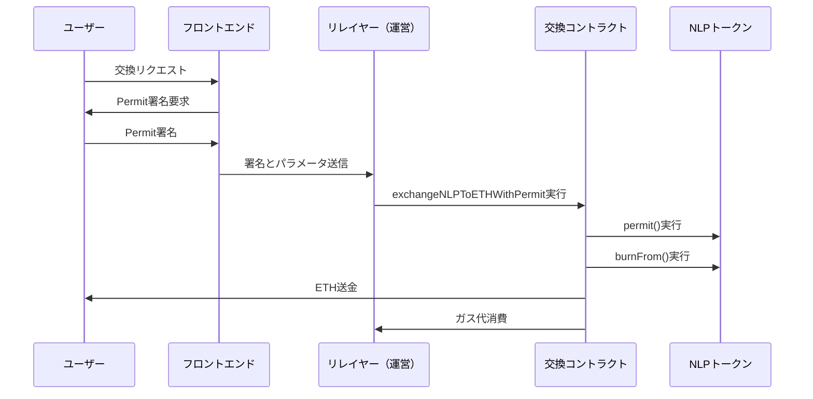

# ガスレス交換機能 - 実装ガイド

## 📋 概要

NewLo Point (NLP) トークンのガスレス交換機能は、ERC20Permitを活用してユーザーがガス代を支払うことなくNLPトークンをETHに交換できる仕組みです。

## 🏗️ アーキテクチャ



## 🔧 実装

### 1. フロントエンド実装 (JavaScript/TypeScript)

```typescript
import { ethers } from 'ethers';

interface PermitSignature {
    v: number;
    r: string;
    s: string;
    deadline: number;
}

/**
 * Permit署名を作成する関数
 */
async function createPermitSignature(
    signer: ethers.Signer,
    tokenAddress: string,
    spenderAddress: string,
    value: string,
    deadline: number
): Promise<PermitSignature> {
    const domain = {
        name: 'NewLo Point',
        version: '1',
        chainId: await signer.getChainId(),
        verifyingContract: tokenAddress
    };

    const types = {
        Permit: [
            { name: 'owner', type: 'address' },
            { name: 'spender', type: 'address' },
            { name: 'value', type: 'uint256' },
            { name: 'nonce', type: 'uint256' },
            { name: 'deadline', type: 'uint256' }
        ]
    };

    const userAddress = await signer.getAddress();
    const nonce = await tokenContract.nonces(userAddress);

    const values = {
        owner: userAddress,
        spender: spenderAddress,
        value: value,
        nonce: nonce,
        deadline: deadline
    };

    const signature = await signer._signTypedData(domain, types, values);
    const sig = ethers.utils.splitSignature(signature);

    return {
        v: sig.v,
        r: sig.r,
        s: sig.s,
        deadline: deadline
    };
}

/**
 * ガスレス交換を実行する関数
 */
async function executeGaslessExchange(
    nlpAmount: string,
    userAddress: string,
    permitSignature: PermitSignature
) {
    const response = await fetch('/api/gasless-exchange', {
        method: 'POST',
        headers: {
            'Content-Type': 'application/json',
        },
        body: JSON.stringify({
            nlpAmount,
            userAddress,
            deadline: permitSignature.deadline,
            v: permitSignature.v,
            r: permitSignature.r,
            s: permitSignature.s
        })
    });

    if (!response.ok) {
        throw new Error('ガスレス交換に失敗しました');
    }

    return await response.json();
}

// 使用例
async function handleGaslessExchange() {
    try {
        const nlpAmount = ethers.utils.parseEther('1000'); // 1000 NLP
        const deadline = Math.floor(Date.now() / 1000) + 3600; // 1時間後
        
        // Permit署名作成
        const permitSignature = await createPermitSignature(
            signer,
            NLP_TOKEN_ADDRESS,
            EXCHANGE_CONTRACT_ADDRESS,
            nlpAmount.toString(),
            deadline
        );

        // ガスレス交換実行
        const result = await executeGaslessExchange(
            nlpAmount.toString(),
            userAddress,
            permitSignature
        );

        console.log('交換完了:', result.transactionHash);
    } catch (error) {
        console.error('エラー:', error);
    }
}
```

### 2. バックエンド実装 (Node.js)

```typescript
import express from 'express';
import { ethers } from 'ethers';

const app = express();
app.use(express.json());

// リレイヤーウォレット設定
const provider = new ethers.providers.JsonRpcProvider(process.env.RPC_URL);
const relayerWallet = new ethers.Wallet(process.env.RELAYER_PRIVATE_KEY, provider);

// コントラクト設定
const exchangeContract = new ethers.Contract(
    EXCHANGE_CONTRACT_ADDRESS,
    EXCHANGE_ABI,
    relayerWallet
);

/**
 * ガスレス交換API
 */
app.post('/api/gasless-exchange', async (req, res) => {
    try {
        const { nlpAmount, userAddress, deadline, v, r, s } = req.body;

        // 入力検証
        if (!nlpAmount || !userAddress || !deadline || !v || !r || !s) {
            return res.status(400).json({ error: 'パラメータが不足しています' });
        }

        // ガス価格とガス制限の設定
        const gasPrice = await provider.getGasPrice();
        const gasLimit = 300000; // 推定ガス制限

        // 交換実行
        const tx = await exchangeContract.exchangeNLPToETHWithPermit(
            nlpAmount,
            deadline,
            v,
            r,
            s,
            userAddress,
            {
                gasPrice: gasPrice.mul(110).div(100), // 10%バッファ
                gasLimit: gasLimit
            }
        );

        console.log(`ガスレス交換実行: ${tx.hash}`);
        
        // トランザクション確認待ち
        const receipt = await tx.wait();

        res.json({
            success: true,
            transactionHash: tx.hash,
            gasUsed: receipt.gasUsed.toString(),
            gasPrice: gasPrice.toString()
        });

    } catch (error) {
        console.error('ガスレス交換エラー:', error);
        res.status(500).json({
            error: 'ガスレス交換に失敗しました',
            details: error.message
        });
    }
});

app.listen(3000, () => {
    console.log('リレイヤーサーバー起動: ポート3000');
});
```

### 3. Solidity実装確認

```solidity
// 新機能: exchangeNLPToETHWithPermit
function exchangeNLPToETHWithPermit(
    uint nlpAmount,
    uint deadline,
    uint8 v,
    bytes32 r,
    bytes32 s,
    address user
) external nonReentrant whenNotPaused {
    // 1. Permit実行（ユーザーの署名でapproval実行）
    nlpToken.permit(user, address(this), nlpAmount, deadline, v, r, s);
    
    // 2. 価格取得と交換計算
    uint ethUsdPrice = getLatestETHPrice();
    uint jpyUsdPrice = getLatestJPYPrice();
    uint ethAmountBeforeFee = (nlpAmount * jpyUsdPrice) / ethUsdPrice;
    uint fee = (ethAmountBeforeFee * exchangeFee) / 10000;
    uint ethAmountAfterFee = ethAmountBeforeFee - fee;
    
    // 3. NLP burnとETH送金
    nlpToken.burnFrom(user, nlpAmount);
    (bool success,) = user.call{value: ethAmountAfterFee}("");
    require(success, "ETH transfer failed");
    
    // 4. イベント発行
    emit GaslessExchangeExecuted(user, msg.sender, nlpAmount, ethAmountAfterFee, ethUsdPrice, jpyUsdPrice, fee);
}
```

## 🔐 セキュリティ考慮事項

### 1. 署名検証
- Permit署名の有効期限チェック
- ユーザーアドレスの検証
- nonce重複チェック

### 2. リレイヤーセキュリティ
```typescript
// リレイヤーの保護機能
const RATE_LIMIT = 10; // 1分間に10回まで
const MAX_AMOUNT = ethers.utils.parseEther('10000'); // 最大10,000 NLP

function validateRequest(userAddress: string, amount: string) {
    // レート制限チェック
    if (getUserRequestCount(userAddress) > RATE_LIMIT) {
        throw new Error('リクエスト制限を超過しました');
    }
    
    // 最大金額チェック
    if (ethers.BigNumber.from(amount).gt(MAX_AMOUNT)) {
        throw new Error('交換金額が上限を超過しています');
    }
}
```

### 3. 監視とログ
```typescript
// 取引監視
function logGaslessExchange(txHash: string, user: string, amount: string, gasUsed: string) {
    console.log({
        timestamp: new Date().toISOString(),
        type: 'GASLESS_EXCHANGE',
        txHash,
        user,
        amount,
        gasUsed
    });
}
```

## 📊 運用メトリクス

### 追跡すべき指標
- ガスレス交換の実行回数
- 運営負担のガス代
- 平均処理時間
- エラー率

### コスト計算例
```typescript
// 1日のガス代コスト計算
const DAILY_EXCHANGES = 1000;
const GAS_PER_EXCHANGE = 250000;
const GAS_PRICE_GWEI = 20;
const ETH_PRICE_USD = 2000;

const dailyGasCost = DAILY_EXCHANGES * GAS_PER_EXCHANGE * GAS_PRICE_GWEI * 1e-9 * ETH_PRICE_USD;
console.log(`1日のガス代コスト: $${dailyGasCost.toFixed(2)}`);
```

## 🚀 デプロイメント

### 1. 環境変数設定
```bash
# .env
RPC_URL=https://rpc.soneium.org/
RELAYER_PRIVATE_KEY=0x...
EXCHANGE_CONTRACT_ADDRESS=0x...
NLP_TOKEN_ADDRESS=0x...
```

### 2. リレイヤーデプロイ
```bash
npm install
npm run build
npm start
```

### 3. フロントエンド統合
```javascript
// ガスレス交換ボタンのイベント
document.getElementById('gasless-exchange').addEventListener('click', handleGaslessExchange);
```

これで、ユーザーは署名のみでNLPトークンをETHに交換でき、ガス代は運営が負担する仕組みが完成しました！ 