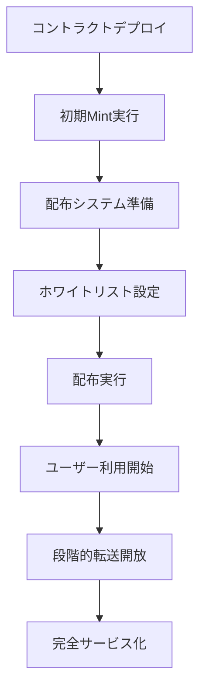

# NewLo Point (NLP) - Production Operations Guide

## 📋 概要

本ドキュメントは、NewLo Point (NLP) トークンシステムの実運用における手順書です。`ScenarioTest.t.sol`で検証されたシナリオに基づき、安全で効率的な運用のための詳細な手順を提供します。

## 🚀 サービス開始までの運用フローチャート



## 📚 Phase 1: システム初期化

### 1.1 コントラクトデプロイ (Deploy)

**前提条件:**
- 管理者ウォレットの準備
- 十分なガス代の確保
- デプロイ用環境変数の設定

**手順:**
```bash
# 1. 環境変数設定
export DEFAULT_ADMIN=0x... # 管理者アドレス
export PAUSER=0x...        # 一時停止権限者
export MINTER=0x...        # Mint権限者

# 2. デプロイ実行
forge script script/Deploy.s.sol --rpc-url $RPC_URL --broadcast --verify

# 3. デプロイ結果確認
forge verify-check --chain-id 1 [GUID]
```

**成功確認項目:**
- ✅ NewLoPoint プロキシコントラクトの正常デプロイ
- ✅ 管理者ロールの正しい設定
- ✅ 初期状態（transfers disabled）の確認

### 1.2 初期状態検証

```solidity
// 管理者ロール確認
bool isAdmin = nlpToken.hasRole(nlpToken.DEFAULT_ADMIN_ROLE(), adminAddress);

// 初期状態確認
bool transfersEnabled = nlpToken.transfersEnabled();      // false
bool whitelistMode = nlpToken.whitelistModeEnabled();     // false
uint256 totalSupply = nlpToken.totalSupply();            // 0
```

## 📚 Phase 2: 初期Mint実行

### 2.1 初期供給量のMint

**目的:** サービスで配布する初期トークン供給量を確保

**手順:**
```solidity
// 1. Minter権限で初期Mint実行
uint256 INITIAL_SUPPLY = 100_000_000 * 10**18; // 1億NLP
nlpToken.mint(adminAddress, INITIAL_SUPPLY);

// 2. Mint成功確認
uint256 adminBalance = nlpToken.balanceOf(adminAddress);
uint256 totalSupply = nlpToken.totalSupply();
assert(adminBalance == INITIAL_SUPPLY);
assert(totalSupply == INITIAL_SUPPLY);
```

**注意事項:**
- Mint量は事業計画に基づいて設定
- 一度にMintする量はガス制限を考慮
- Mint履歴は必ずログに記録

## 📚 Phase 3: バルク配布システム準備

### 3.1 TokenDistributionV2のデプロイ

```solidity
// 1. 配布コントラクトデプロイ
TokenDistributionV2 distributionContract = new TokenDistributionV2(
    address(nlpToken),     // NLPトークンアドレス
    distributionOwner      // 配布管理者
);

// 2. デプロイ確認
address tokenAddress = distributionContract.nlpToken();
address owner = distributionContract.owner();
```

### 3.2 ホワイトリスト設定（効率的配布のため）

```solidity
// 1. 転送機能を有効化
nlpToken.setTransfersEnabled(true);

// 2. ホワイトリストモードを有効化
nlpToken.setWhitelistModeEnabled(true);

// 3. 配布コントラクトをホワイトリストに追加
nlpToken.setWhitelistedAddress(address(distributionContract), true);

// 4. 配布管理者をホワイトリストに追加
nlpToken.setWhitelistedAddress(distributionOwner, true);
```

### 3.3 配布用トークンの預入

```solidity
// 1. 配布管理者にトークンを転送
uint256 BULK_DEPOSIT_AMOUNT = 50_000_000 * 10**18; // 5000万NLP
nlpToken.transfer(distributionOwner, BULK_DEPOSIT_AMOUNT);

// 2. 配布コントラクトに預入
nlpToken.approve(address(distributionContract), BULK_DEPOSIT_AMOUNT);
distributionContract.depositTokens(BULK_DEPOSIT_AMOUNT);

// 3. 預入確認
uint256 contractBalance = nlpToken.balanceOf(address(distributionContract));
assert(contractBalance == BULK_DEPOSIT_AMOUNT);
```

## 📚 Phase 4: バルク配布実行

### 4.1 配布前チェックリスト

**必須確認項目:**
- ✅ ホワイトリストモードが有効
- ✅ 配布コントラクトがホワイトリストに登録済み
- ✅ 配布コントラクトに十分な残高がある
- ✅ 受信者アドレスの重複チェック完了
- ✅ ネットワーク混雑状況の確認

```solidity
// セットアップ状況確認
(
    bool isWhitelistModeEnabled,
    bool isContractWhitelisted,
    uint256 contractBalance,
    bool canDistribute
) = distributionContract.checkSetupStatus();

require(canDistribute, "Distribution setup not ready");
```

### 4.2 実運用配布パラメータ

**推奨バッチサイズ:**

| ネットワーク状況 | 推奨ユーザー数 | 予想ガス使用量 | 備考 |
|----------------|---------------|---------------|------|
| **混雑時** | 50ユーザー | ~3.8M ガス | 最も安全 |
| **通常時** | 75ユーザー | ~5.6M ガス | バランス重視 |
| **空いている時** | 100ユーザー | ~7.5M ガス | 効率重視 |

### 4.3 バルク配布実行

```solidity
// 1. 受信者アドレス配列の準備
address[] memory recipients = new address[](batchSize);
// ... recipients配列に受信者アドレスを設定 ...

// 2. 配布実行
uint256 DISTRIBUTION_AMOUNT = 1000 * 10**18; // 1,000 NLP per user
uint256 batchId = distributionContract.distributeEqual(recipients, DISTRIBUTION_AMOUNT);

// 3. 配布成功確認
for (uint i = 0; i < recipients.length; i++) {
    uint256 balance = nlpToken.balanceOf(recipients[i]);
    assert(balance >= DISTRIBUTION_AMOUNT);
}
```

### 4.4 配布監視とログ管理

```solidity
// 配布統計の確認
(
    uint256 totalDistributed,
    uint256 totalDistributions,
    uint256 todayDistributed,
    uint256 contractBalance,
    bool isLowBalance,
    bool isAntiDuplicateEnabled
) = distributionContract.getDistributionStats();

// ログ出力例
console.log("Batch ID:", batchId);
console.log("Recipients:", recipients.length);
console.log("Total distributed today:", todayDistributed);
console.log("Remaining balance:", contractBalance);
```

## 📚 Phase 5: ユーザー利用段階

### 5.1 初期段階（ホワイトリストモード）

**特徴:**
- ユーザー間転送は制限
- 承認されたアドレス（取引所等）のみ転送可能
- サービス内ポイントとして機能

**管理操作:**
```solidity
// 重要パートナー（取引所等）をホワイトリストに追加
address[] memory partners = [exchange1, exchange2, marketplace];
nlpToken.setWhitelistedAddresses(partners, true);
```

### 5.2 ユーザーサポート対応

**よくある問題と対応:**

1. **「転送ができない」**
   - 現在の転送設定を確認
   - ホワイトリスト状況を説明

2. **「残高が表示されない」**
   - ウォレットでのトークン追加方法を案内
   - コントラクトアドレスを提供

3. **「配布を受け取れない」**
   - アドレスの正確性を確認
   - 重複配布防止機能の説明

## 📚 Phase 6: 段階的転送解放

### 6.1 取引所対応準備

**事前準備:**
- 取引所との技術的調整完了
- 流動性確保の準備
- 価格監視体制の構築

```solidity
// 主要取引所をホワイトリストに追加
address[] memory exchanges = [binance, coinbase, kraken];
nlpToken.setWhitelistedAddresses(exchanges, true);
```

### 6.2 完全転送解放

**実行手順:**
```solidity
// 1. 最終確認
require(nlpToken.whitelistModeEnabled(), "Already in whitelist mode");
require(exchangesReady, "Exchanges not ready");

// 2. 完全転送有効化
nlpToken.setTransfersEnabled(true);
nlpToken.setWhitelistModeEnabled(false); // 段階的解放の場合はオプション

// 3. 解放確認
bool transfersEnabled = nlpToken.transfersEnabled();
bool whitelistMode = nlpToken.whitelistModeEnabled();
```

## 📚 Phase 7: 緊急時対応

### 7.1 緊急停止手順

**緊急停止が必要な状況:**
- セキュリティ脆弱性の発見
- 不正な大量転送の検知
- システム障害の発生

```solidity
// 1. 全機能の緊急停止
nlpToken.pause();
distributionContract.pause();

// 2. 状況確認
bool isPaused = nlpToken.paused();
bool isDistributionPaused = distributionContract.paused();

// 3. 関係者への通知
emit EmergencyPause(block.timestamp, reason);
```

### 7.2 復旧手順

```solidity
// 1. 問題解決の確認
require(issueResolved, "Issue not resolved");

// 2. 段階的復旧
nlpToken.unpause();
distributionContract.unpause();

// 3. 復旧確認
require(!nlpToken.paused(), "Token still paused");
require(!distributionContract.paused(), "Distribution still paused");
```

## 📊 監視とアラート

### 8.1 日常監視項目

**トークンコントラクト:**
- 総供給量の変化
- 大口転送の監視
- 異常なガス使用量

**配布コントラクト:**
- 残高の監視
- 配布頻度の監視
- 重複配布の検知

### 8.2 アラート設定

```javascript
// 監視スクリプト例
const monitoringConfig = {
    largeTransferThreshold: 1000000 * 10**18,  // 100万NLP
    lowBalanceThreshold: 1000000 * 10**18,     // 残高100万NLP以下
    dailyDistributionLimit: 10000000 * 10**18,  // 日次配布上限1000万NLP
};
```

## 📞 エスカレーション

### 9.1 緊急連絡体制

1. **Level 1**: 運用担当者
2. **Level 2**: 技術責任者
3. **Level 3**: 経営陣・法務

### 9.2 外部連絡先

- **セキュリティ監査会社**
- **ブロックチェーン専門法律事務所**
- **主要取引所の技術窓口**

---

## 📝 付録

### A. よく使用するコマンド集

```bash
# 残高確認
cast call $TOKEN_ADDRESS "balanceOf(address)(uint256)" $USER_ADDRESS

# 転送設定確認
cast call $TOKEN_ADDRESS "transfersEnabled()(bool)"
cast call $TOKEN_ADDRESS "whitelistModeEnabled()(bool)"

# 配布統計確認
cast call $DISTRIBUTION_ADDRESS "getDistributionStats()(uint256,uint256,uint256,uint256,bool,bool)"
```

### B. トラブルシューティング

| 問題 | 原因 | 解決方法 |
|------|------|----------|
| Mint失敗 | MINTER_ROLE不足 | ロール確認・付与 |
| 転送失敗 | ホワイトリスト未登録 | アドレス追加 |
| 配布失敗 | ガス不足 | バッチサイズ削減 |

---

**作成日**: 2024年12月
**バージョン**: 1.0
**最終更新**: ScenarioTest.t.sol v1.0 対応 